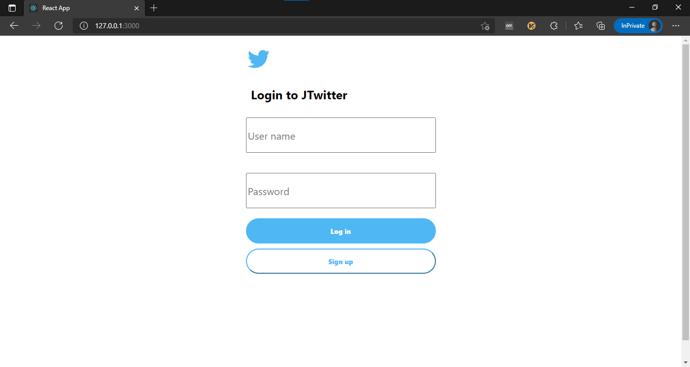
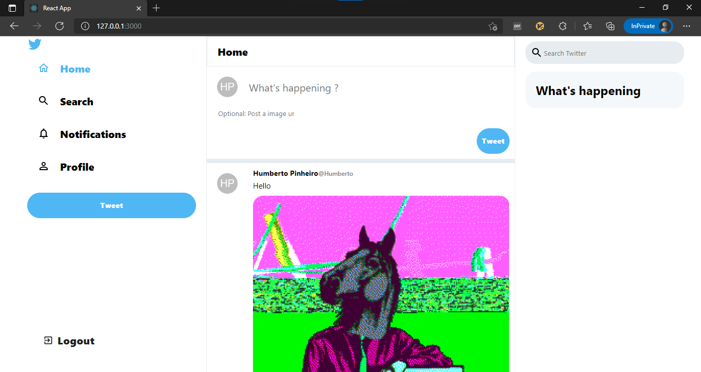

# jtwitter 🚀 

A simple twitter clone

## Stack
- Java 11
- Spring Boot
- Restful
- Spring Security
- H2 database
- React

### Rest routes
- Login (POST) ✔ 
- User registration (POST) __TODO__
- Find user  (GET) __TODO__
- Create tweet (POST) __TODO__
- Find tweet (GET) __TODO__
- List all tweets (GET) ✔ 
- List tweets by user (GET) __TODO__
- List one tweet (GET) __TODO__
- Delete tweet (DELETE) __TODO__
- Like/unlike on tweet (PUT) __TODO__

### React components
- Login ✔
- User registration __TODO__
- Create tweet __TODO__
- List tweets ✔ 
- Tweet ✔
- Search user __TODO__
- Search tweet __TODO__

### Development
- Backend 

``` 
mvn spring-boot:run 
```

- Frontend 
``` 
cd react-app
npm start
```

- Build for production

```
mvn clean package -Pprod
```


